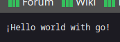
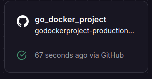
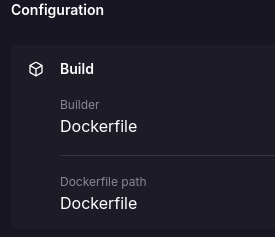
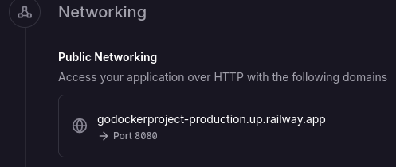

# Hello world whit go
## Results
<p align="center">
    
</p>

Web application that deploys a web server and builds a simple API with a route that displays the message **hello world with go!**

## :open_book: How to use
### Pre-requisites
* go language
* code editor
---

* Clone the repository
    ```
    git clone https://github.com/Pablo-man/go_docker_project.git
    ```
* Open the program with the code editor of your choice
* Open a terminal that points to the root of the project
* Run the command:

    `go run main.go`
* Visit your `localhost:8080` to view the results

    > [!TIP]
    > By default the application will be deployed on port `8080`, if it is necessary to change it to another one you must modify it from the `main.go` file and in the `http.ListenAndServe(":<PORTNUMBER>", nil)` section place the desired port

## :rocket: How to run with docker
### Pre-requisites
* Docker - DockerDesktop installed
* DockerHub account
---
Visit the following link to learn about the process of generating the project image

:whale2: [GO](https://hub.docker.com/repository/docker/pamendeza/go_docker_project "Docker steps")

## :light_rail: PAAS Deploy(Railway)
For its deployment in a PAAS we will rely on railway and its easy implementation thanks to its container management. 



The platform automatically uses our Dockerfile to build the container. 



> [!IMPORTANT]
> Next, the configuration that we must add is the generation of a domain along with the desired port, in this case the indicated thing would be to point to port 80 on which nginx is working



[Hello World](https://jsproyectdocker-production.up.railway.app "click for visit")